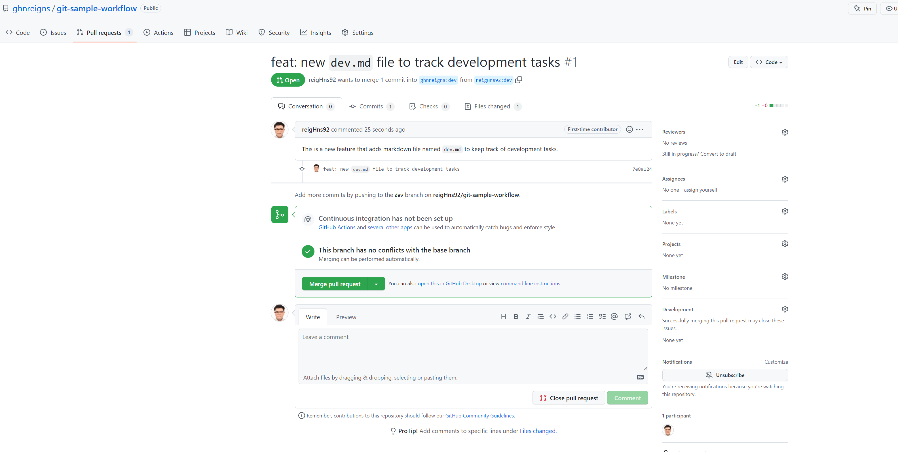

This workflow described in this section is a generic workflow, for other detailed models of workflows,
refer to [Atlassian's Git Workflows](https://www.atlassian.com/git/tutorials/comparing-workflows) for more details.

### Fork the Repository

We will first start off by going to the repository you are interested in and click on the **Fork** 
button on the top right.

I will use a [public repository](https://github.com/ghnreigns/git-sample-workflow) named **git-sample-workflow** from my other account.

This will replicate his entire repository into my own GitHub account. 
Remember to uncheck the box **Copy the `main` branch only**
if you decide to work on the forked repository's branches as well.

### Clone your Forked Repository

I have a fork of the **test** repository on my GitHub server, but to start developing, I will have to 
clone this forked repository locally on my computer.

Depending on HTTPS or SSH key, one might copy different URLs for the forked repository.


=== "Git Clone Forked Repo"

    ```bash title="git clone forked repo"
    ~/gaohn $ git clone https://github.com/reigHns92/git-sample-workflow.git
    ```

=== "Outputs"

    ```
    Cloning into 'git-sample-workflow'...
    remote: Enumerating objects: 6, done.
    remote: Counting objects: 100% (6/6), done.
    remote: Compressing objects: 100% (3/3), done.
    remote: Total 6 (delta 0), reused 0 (delta 0), pack-reused 0
    Receiving objects: 100% (6/6), done.
    ```

For a more detailed step-by-step guide, [GitHub Docs's Quickstart: Fork a repo](https://
docs.github.com/en/get-started/quickstart/fork-a-repo)
provides a templated method to do fork and clone.

### Sync Forked Repository with Upstream

Before we go on, we define [two key terms](https://stackoverflow.com/questions/9257533/what-is-the-difference
-between-origin-and-upstream-on-github#:~:text=upstream%20generally%20refers%20to%20the,
the%20original%20repo%20of%20GitHub) in the context of [GitHub Forks](https://help.github.com/articles/fork-a-repo/):

- `origin`: this refers to one's own repository (i.e. the forked and cloned repository on your personal account);
- `upstream`: generally refers to the original repository that you have forked.

In general, it is also useful to understand [upstreams and downstreams](https://stackoverflow.com/que
stions/2739376/definition-of-downstream-and-upstream/2749166#2749166).

Back to where we left off, you can continue to develop on the forked repository but the
**original repository** you forked from (the `upstream`) will not automatically sync with
your `origin`. In other words, if the `upstream` repository made 10 new commits, your `origin`
will have no information on those 10 new commits.

To be able to sync changes, we will have to first configure a remote for the fork, and fetch from upstream to sync.

#### Configuring a Remote for a Forked Repository

The steps are referenced from [GitHub Docs](https://docs.github.com/en/pull-requests/collaborating-with
-pull-requests/working-with-forks/configuring-a-remote-for-a-fork). They have included steps for 
different OS. We will reproduce the steps on macOS.

1. Open the terminal;

2. A handy command to check what remote repository your forked repo has. Note that one can have many
   remotes! 

    ```bash title="list out all remotes" linenums="1"
    ~/gaohn                     $ cd git-sample-workflow
    ~/gaohn/git-sample-workflow $ git remote -v
    
    > origin	https://github.com/reigHns92/git-sample-workflow.git (fetch)
    > origin	https://github.com/reigHns92/git-sample-workflow.git (push)
    ```

3. Specify a new remote *upstream* repository that will be synced with the fork.
   To do so, go to the original [repository](https://github.com/ghnreigns/git-sample-workflow.git) (the one you forked from) and copy the
   URLs (HTTPS or SSH) to add to remote (upstream).
   
    ```bash title="configuring remote for forked repo" linenums="1"
    ~/gaohn/git-sample-workflow $ git remote add upstream https://github.com/ghnreigns/git-sample-workflow.git

    > origin	https://github.com/reigHns92/git-sample-workflow.git (fetch)
    > origin	https://github.com/reigHns92/git-sample-workflow.git (push)
    ```

    You can verify the new upstream repository is added by checking `git remove -v` again.

    ```bash title="list out all remotes" linenums="1"
    ~/gaohn/git-sample-workflow $ git remote -v
    
    > origin	https://github.com/reigHns92/git-sample-workflow.git (fetch)
    > origin	https://github.com/reigHns92/git-sample-workflow.git (push)
    > upstream	https://github.com/ghnreigns/git-sample-workflow.git (fetch)
    > upstream	https://github.com/ghnreigns/git-sample-workflow.git (push)
    ```

#### Syncing the Forked Repository with Upstream 

Now I will use my other account to make a new commit [32f5bbd
](https://github.com/ghnreigns/git-sample-workflow/commit/32f5bbd7ba31bb4d50e40c27fca946ebc32dbefe) on the repository's main branch (i.e the upstream) and now
my forked repository will be 1 commit behind.

<figure markdown>
  { width="600" }
  <figcaption>Image caption</figcaption>
</figure>

To keep my repository up to date, we will refer to [GitHub Docs](https://docs.github.com/en/pull-requests/collaborating-with-pull-
requests/working-with-forks/syncing-a-fork#syncing-a-fork-branch-from-the-command-line)
section on syncing a fork branch from the command line.

1. In the same terminal, we fetch all branches and commites from the upstream repository.

    ```bash title="fetching from upstream repo" linenums="1"
    ~/gaohn/git-sample-workflow $ git fetch upstream

    > remote: Enumerating objects: 5, done.
    > remote: Counting objects: 100% (5/5), done.
    > remote: Compressing objects: 100% (2/2), done.
    > remote: Total 3 (delta 1), reused 0 (delta 0), pack-reused 0
    > Unpacking objects: 100% (3/3), 711 bytes | 71.00 KiB/s, done.
    > From https://github.com/ghnreigns/git-sample-workflow
    > * [new branch]      main       -> upstream/main
    ```

2. Switch to your fork's main branch (or the branch you want the changes to be synced and merged).

    ```
    ~/gaohn/git-sample-workflow $ git checkout main
    ```

3. Before you merge, you can use `git log` from the [previous section](git.md#synchronize-origin-with-git-fetch)
    to check what was committed on the upstream repository.

    ```bash title="checking what was committed on upstream" linenums="1"
    ~/gaohn/git-sample-workflow $ git log --oneline upstream/main..main
    ```
       
    and it indeed returns the message `32f5bbd (upstream/main) git: update README.md for new commit`
    which was indeed the commit [32f5bbd
    ](https://github.com/ghnreigns/git-sample-workflow/commit/32f5bbd7ba31bb4d50e40c27fca946ebc32dbefe) done on my other account.

4. Merge the changes from the upstream default branch - in this case, `upstream/main` - into your local default branch. 
   This brings your fork's default branch into sync with the upstream repository, without losing your local changes.

    ```bash title="merge with upstream" linenums="1"
    ~/gaohn/git-sample-workflow $ git merge upstream/main

    > Updating 2d47f2d..32f5bbd
    > Fast-forward
    > README.md | 2 ++
    > 1 file changed, 2 insertions(+)
    ```

5. Now it is time to push the commits to the origin repository, a quick `git status` will tell you
    that you are 1 commit ahead of the origin repository.

    ```bash title="checking status" linenums="1"
    ~/gaohn/git-sample-workflow $ git status

    > On branch main
    > Your branch is ahead of 'origin/main' by 1 commit.
    > (use "git push" to publish your local commits)
    ```

    and we will use `git push` to push the commits to the origin repository.

    ```bash title="pushing to origin" linenums="1"
    ~/gaohn/git-sample-workflow $ git push -u origin main

    > Total 0 (delta 0), reused 0 (delta 0), pack-reused 0
    > To https://github.com/reigHns92/git-sample-workflow.git
    >    2d47f2d..32f5bbd  main -> main
    > Branch 'main' set up to track remote branch 'main' from 'origin'.
    ```

    After this step, the origin (forked) repo of mine will be in sync with the upstream as can be verified by
    the message "This branch is up to date with ghnreigns/git-sample-workflow:main." on your main branch github.

#### Syncing the Forked Repository with Upstream's Other Branches

Let's say our upstream repository created a new branch `dev` and we want to sync our forked repository with it
(note that our forked repository `origin` does not have this branch yet).

We can first `git fetch upstream` to fetch all branches and commits from the upstream repository.
We see that `git` tells us the following:

```bash
From https://github.com/ghnreigns/git-sample-workflow
 * [new branch]      dev        -> upstream/dev
```

which means that the upstream repository has a new branch `dev` and it "downloads (fetch)" it to our local repository.

Notice that the `dev` branch does not automatically appear in your local git (i.e. calling `git checkout dev` does not work).
The `dev` branch exists in both `origin` and `upstream` as can be seen by `git branch -a`.

There are [two ways](https://www.freecodecamp.org/news/git-checkout-remote-branch-tutorial/) to "fetch" the `dev` repo to your local:

- `git checkout -b dev upstream/dev` will create a branch named `dev` that pulls the information from the `upstream/dev` branch;
- Alternatively, you can `git checkout -b dev origin/main` which essentially fetches the `dev` branch on your forked repo and then
we can do `git merge upstream/dev` to be in sync.


### Creating Pull Request

Now on my local `dev` branch, I made some changes and committed to 
[7e8a124](https://github.com/reigHns92/git-sample-workflow/commit/7e8a124590d1c33f88bc124a0df294a423886713)
using `git push -u origin dev`.

I now want to create a pull request for the upstream repository owner to see my changes, and to merge into his repo if necessary.

We first go to our `origin` (forked) [repository](https://github.com/reigHns92/git-sample-workflow/tree/dev) and see that there is a new popup on "compare and pull request".
We click it and the following interface will appear, that is for you to write a message to the upstream author.

<figure markdown>
  { width="600" }
  <figcaption>Image caption</figcaption>
</figure>

Once you created pull request, you can wait for the upstream author to decide and reply.
Since I am the owner of the other account, I went in and see the following:

<figure markdown>
  { width="600" }
  <figcaption>Image caption</figcaption>
</figure>

and proceeded to approve the merge request.

We used the default option to merge the pull request, which is to merge into the `dev` branch
of the upstream repository and create a new commit (SHA 1fa405d). We can have different types of merge
which we can read up more [here](https://docs.github.com/en/github/collaborating-with-issues-and-pull-requests/about-pull-request-merges).

Consequently, you will need to repeat the following steps to sync your forked repository's `dev` branch with the upstream repository's `dev` branch:

```bash title="syncing forked repo with upstream" linenums="1"
~/gaohn/git-sample-workflow $ git checkout dev
~/gaohn/git-sample-workflow $ git fetch upstream
~/gaohn/git-sample-workflow $ git merge upstream/dev
~/gaohn/git-sample-workflow $ git push -u origin dev
```

even though the point is slightly moot since this step is exactly the same as the previous commit.